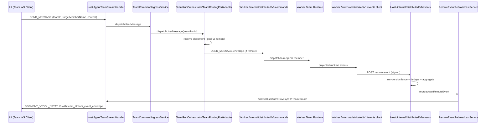

# Agent Team Communication: Local + Distributed

## Purpose

This document is the implementation-level source of truth for how team communication works across:

- local-only team execution on one node
- distributed team execution across host + worker nodes
- WebSocket delivery to UI clients (`/ws/agent-team/:teamId`)

It also explains the compatibility layer between legacy runtime event names and current server message types.

## Scope

In scope:

- inbound command path (`SEND_MESSAGE`, tool approvals)
- team run creation/lookup and placement
- routing decisions (local vs remote)
- worker uplink of runtime events back to host
- host rebroadcast to team WebSocket clients
- event-type normalization and compatibility handling

Out of scope:

- LLM prompt engineering internals
- detailed frontend store rendering implementation (covered in web docs)

## Core Runtime Components

### Team command ingress + run lifecycle

- `src/distributed/ingress/team-command-ingress-service.ts`
- `src/distributed/ingress/team-run-locator.ts`
- `src/distributed/team-run-orchestrator/team-run-orchestrator.ts`

Responsibilities:

- resolve or create active `teamRunId` for a runtime `teamId`
- ensure placement exists before dispatch
- apply run degradation policy on repeated dispatch failures
- fence tool approvals with run/version/invocation tokens

### Routing adapters

- Host routing: `src/distributed/routing/team-routing-port-adapter.ts`
- Worker uplink routing: `src/distributed/routing/worker-uplink-routing-adapter.ts`
- Local team manager routing port consumer: `autobyteus-ts/src/agent-team/context/team-manager.ts`

Responsibilities:

- host decides local vs remote target member dispatch
- remote dispatch via signed internal envelopes
- worker-side team manager forwards inter-agent/user/tool-approval dispatch back through host when needed

### Internal transport

- Worker command ingress route:
  `src/distributed/transport/internal-http/register-worker-distributed-command-routes.ts`
- Host distributed command client:
  `src/distributed/transport/internal-http/host-distributed-command-client.ts`
- Worker event uplink client:
  `src/distributed/transport/internal-http/worker-event-uplink-client.ts`
- Host event ingestion route:
  `src/distributed/transport/internal-http/register-host-distributed-event-routes.ts`

Responsibilities:

- signed POST transport for distributed envelopes/events
- run-version fencing + idempotency on host event ingestion

### Team stream projection

- Team WS adapter:
  `src/services/agent-streaming/agent-team-stream-handler.ts`
- Stream message types:
  `src/services/agent-streaming/models.ts`
- Aggregation + rebroadcast:
  `src/distributed/event-aggregation/team-event-aggregator.ts`
  `src/distributed/event-aggregation/remote-event-rebroadcast-service.ts`

Responsibilities:

- project runtime/team events to WebSocket `ServerMessage`
- normalize distributed payload shapes
- attach team stream envelope metadata (`team_run_id`, `sequence`, `origin`, etc.)
- preserve member identity (`agent_name`, `agent_id`, `member_route_key`)

## End-to-End Flows

### 1) Team user input from UI WebSocket

Entry:

- UI sends `ClientMessageType.SEND_MESSAGE` to `/ws/agent-team/:teamId`
- handled by `AgentTeamStreamHandler.handleSendMessage()`

Flow:

1. Parse input into `AgentInputUserMessage`.
2. Call `teamCommandIngressService.dispatchUserMessage({ teamId, userMessage, targetMemberName })`.
3. `TeamRunLocator.resolveOrCreateRun(teamId)` resolves active run or starts one via `TeamRunOrchestrator.startRunIfMissing(...)`.
4. `TeamRunOrchestrator.dispatchUserMessage(...)` delegates to routing adapter for target member.
5. `TeamRoutingPortAdapter` chooses:
   - local member: dispatch through local routing port adapter
   - remote member: ensure remote node bootstrap, then send `USER_MESSAGE` envelope to worker

### 2) Inter-agent message dispatch (`send_message_to`)

Flow inside runtime:

1. Sender agent emits inter-agent request event.
2. Team manager dispatches through `teamRoutingPort`.
3. On host, `TeamRoutingPortAdapter.dispatchInterAgentMessageRequest(...)` routes local or remote.
4. On worker, `dispatchInterAgentMessage` envelope is handled in
   `default-distributed-runtime-composition.ts` and attempts:
   - worker-local routing port path (`dispatchWithWorkerLocalRoutingPort`)
   - team-manager direct inter-agent path (`dispatchInterAgentMessageViaTeamManager`)
   - final fallback to `team.postMessage(...)` only if manager path unavailable

Design note:

- Worker-local routing path is now first-class. This avoids bypassing routing logic and prevents silent wrong-target behavior.

### 3) Worker-to-host event uplink and host rebroadcast

Worker side:

1. Worker team event stream is consumed.
2. `projectRemoteExecutionEventsFromTeamEvent(...)` converts team events to member-scoped projected events.
3. `RemoteMemberExecutionGateway.emitMemberEvent(...)` calls worker uplink client.
4. Worker POSTs signed event to host `/internal/distributed/v1/events`.

Host side:

1. Verify signature/auth.
2. Drop stale run version via `RunVersionFencingPolicy`.
3. Drop duplicate source event via `RemoteEventIdempotencyPolicy`.
4. Aggregate event (`origin=remote`) and rebroadcast via
   `RemoteEventRebroadcastService -> AgentTeamStreamHandler.publishDistributedEnvelopeToTeamStream`.
5. WS clients receive normalized `ServerMessage`.

### 4) Team-local events (non-remote)

For host-local members, `AgentTeamStreamHandler.streamLoop()` reads team event stream and calls
`convertTeamEvent()`, then wraps with team event envelope through `attachTeamStreamEnvelope(...)`.

Both local and remote paths therefore publish the same envelope shape to clients.

## WebSocket Message Contract

Canonical server message types are in:

- `src/services/agent-streaming/models.ts` (`ServerMessageType`)

Key message groups:

- Segment stream: `SEGMENT_START`, `SEGMENT_CONTENT`, `SEGMENT_END`
- Agent lifecycle: `AGENT_STATUS`, `ASSISTANT_COMPLETE`, `ERROR`
- Tool lifecycle: `TOOL_APPROVAL_REQUESTED`, `TOOL_EXECUTION_*`, `TOOL_LOG`
- Team scope: `TEAM_STATUS`, `TASK_PLAN_EVENT`, `CONNECTED`

## Team History Projection Contract

Historical team member hydration should use team-scoped identity (`teamId + member_route_key`) instead of
host-local `agentId` lookups alone.

Current server contract:

- `getTeamRunResumeConfig(teamId)` returns member bindings and run metadata.
- `getTeamMemberRunProjection(teamId, memberRouteKey)` resolves projection with:
  - local-first lookup on host memory projection;
  - remote-node fallback when the member is placed remotely and local projection is empty;
  - safe fallback to local result when remote lookup is unavailable.

This keeps local and distributed team history behavior consistent at the UI restore boundary.

## Member identity contract (critical)

For member-scoped delivery, payload should include:

- `agent_name`: logical member name
- `agent_id`: runtime agent id when available
- `member_route_key`: stable route key for nested routing contexts
- `event_scope: "member_scoped"`

Team-scoped events include `event_scope: "team_scoped"`.

## Team stream envelope

All projected team messages may include:

- `team_stream_event_envelope.team_run_id`
- `team_stream_event_envelope.run_version`
- `team_stream_event_envelope.sequence`
- `team_stream_event_envelope.source_node_id`
- `team_stream_event_envelope.origin` (`local` | `remote`)
- `team_stream_event_envelope.event_type`
- `team_stream_event_envelope.received_at`

This envelope powers ordering and cross-node debugging.

## Segment Event Normalization

Distributed payloads can arrive nested (`payload.payload`) or flat. Server normalizes in
`normalizeDistributedSegmentPayload(...)`:

- hoist nested `segment_type`, `delta`, `metadata`, `id`, `segment_id`, `event_type`
- if `id` missing but `segment_id` exists, copy `segment_id -> id`

This keeps frontend segment parser compatible with strict `id` checks.

## Distributed Runtime Event Contract

`team-runtime-event-protocol.ts` accepts canonical distributed runtime event names only:

- canonical stream runtime events (`segment_event`, `assistant_complete_response`, `tool_*`, `error_event`, etc.)
- explicit `AGENT:<ServerMessageType>` wrappers used by aggregated local envelopes
- `task_plan:*` namespace mapped to `TASK_PLAN_EVENT`

Internal notifier event names (`agent_data_*`) are not accepted at distributed rebroadcast boundary.

Deprecated in distributed WS projection:

- `assistant_chunk` is currently dropped from distributed rebroadcast path
  (`DEPRECATED_DISTRIBUTED_RUNTIME_EVENT_TYPES`)

Important:

- `assistant_chunk` and `assistant_complete_response` are still defined and emitted in `autobyteus-ts`
  runtime stream/event classes and used by non-team stream consumers. Do not remove blindly without
  cross-repo migration.

## Local vs Distributed Behavior Differences (Expected)

Expected differences:

- If only segment events are emitted for a run, UI text appears via `SEGMENT_CONTENT` rather than `ASSISTANT_CHUNK`.
- Tool activity may appear first in parsing state until `SEGMENT_END` + tool lifecycle events arrive.

Unexpected differences to treat as bugs:

- Member-scoped event missing resolvable identity (`agent_name`/`member_route_key`/`agent_id`) and dropped by client.
- Segment events missing `id` after server normalization.
- Distributed event types not recognized and converted to `ERROR`.

## Known Historical Failure Modes and Root Causes

### 1) Wrong member instantiated on host during lazy create

Observed pattern:

- `sendMessageToTeam` without `teamId` can execute lazy local creation path in
  `src/api/graphql/types/agent-team-instance.ts`.
- If caller passes mismatched DB-local references, wrong persona/member may be constructed.

Mitigation direction:

- prefer explicit existing `teamId` path
- for distributed teams, ensure creation path is placement-aware and uses stable identifiers

### 2) `MISSING_TOOL_NAME` in activity panel

Root cause:

- frontend `segmentHandler` requires `metadata.tool_name` on `tool_call` `SEGMENT_START`
- if backend omits it, activity falls back to `MISSING_TOOL_NAME`

Contract:

- backend must include `payload.metadata.tool_name` for `tool_call` segments

### 3) Missing return path from remote member to host coordinator

Root cause (historical):

- inter-agent reply on worker bypassed routed dispatch path in some branches
- host never received return event

Mitigation:

- ensure worker-side dispatch uses routing-first path (`dispatchWithWorkerLocalRoutingPort`)
- keep `TeamManager.setTeamRoutingPort(...)` bound to worker uplink adapter for run

## Operational Debugging Guide

### Server-side toggles

- `AUTOBYTEUS_DEBUG_TEAM_WS=1`:
  logs summarized outgoing team WS messages from `AgentTeamStreamHandler`

### Transport/addressing signals

- `[DistributedAddressResolution] ...` log entries indicate how node URL was resolved:
  - `directory`
  - `directory_rewritten_loopback`
  - `bootstrap_fallback`
  - `unresolved`

If worker->host uplink uses loopback URL incorrectly, verify:

- `AUTOBYTEUS_NODE_DISCOVERY_REGISTRY_URL`
- `AUTOBYTEUS_DISTRIBUTED_UPLINK_BASE_URL`
- `AUTOBYTEUS_DISTRIBUTED_LOCAL_BASE_URL`
- node directory entries for host/worker IDs

### Verification checklist

For a team message roundtrip (professor -> student -> professor), verify:

1. Host WS receives `send_message_to` tool segment start with tool metadata.
2. Worker member receives inter-agent message event.
3. Worker emits outbound inter-agent/tool/segment events uplinked to host.
4. Host `/internal/distributed/v1/events` accepts event (not stale/duplicate).
5. Host rebroadcasts remote projection to team WS.
6. UI resolves member identity and appends content to correct pane.

## Implementation Invariants

- Every active `teamId` command must resolve to exactly one active `teamRunId`.
- Routing decisions are made from placement map, never from local DB assumptions.
- Every member-scoped WS event should include resolvable member identity fields.
- Segment events delivered to clients must contain non-empty `id`.
- Remote event rebroadcast must be idempotent and run-version fenced.

## Sequence Diagram

## Related Files

- `src/services/agent-streaming/agent-team-stream-handler.ts`
- `src/services/agent-streaming/agent-stream-handler.ts`
- `src/distributed/bootstrap/default-distributed-runtime-composition.ts`
- `src/distributed/ingress/team-command-ingress-service.ts`
- `src/distributed/team-run-orchestrator/team-run-orchestrator.ts`
- `src/distributed/routing/team-routing-port-adapter.ts`
- `src/distributed/routing/worker-uplink-routing-adapter.ts`
- `src/distributed/transport/internal-http/register-worker-distributed-command-routes.ts`
- `src/distributed/transport/internal-http/register-host-distributed-event-routes.ts`
- `src/distributed/event-aggregation/remote-event-rebroadcast-service.ts`
